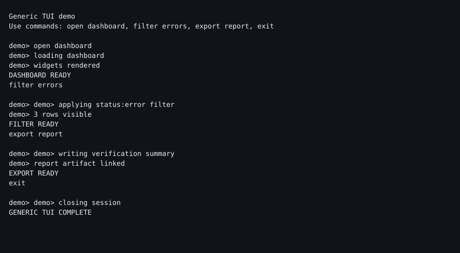

# TermProof

[](https://github.com/md-mt/termproof/actions/workflows/ci.yml)
[](https://github.com/md-mt/termproof/actions/workflows/release.yml)
[](https://github.com/md-mt/termproof)
[](LICENSE)
[](https://www.python.org)


> **Evidence-first verification for terminal and TUI applications.** No more "trust me, it works in my terminal." Record the real session, replay it, and ship the proof.

TermProof is a harness that drives your TUI from JSON recipes, records the actual terminal with [`asciinema`](https://docs.asciinema.org/), replays the cast into screenshots and text snapshots, optionally renders a 60-fps MP4 via [`agg`](https://github.com/asciinema/agg) + `ffmpeg`, and writes Markdown and JSON reports. Your reviewers inspect evidence instead of trusting a log line.

---

## What is this?

- **You ship a TUI** — built with Textual, Bubble Tea, Ratatui, Ink, or plain curses.
- **You write a recipe** — JSON that says: launch the binary, wait for `dashboard>`, type `open`, wait for `DASHBOARD READY`, assert it appeared.
- **TermProof runs it** — real PTY, real asciinema cast, deterministic, CI-friendly.
- **You get proof** — `session.cast`, `final.svg`, `final.txt`, `session.mp4`, per-step screenshots, `result.json`, `report.md`. Upload the folder as a CI artifact and link it from the PR.

Product-agnostic by design. Pi coding-agent workflows are included as the flagship showcase because they exercise realistic multi-turn agent UI flows.

## Why not X?

| Tool | Approach | Where it falls short for TUI evidence |
| --- | --- | --- |
| **Screenshots in docs** | Manual `screencap` | Stale within one PR; no replay; no assertion. |
| **expect / pexpect alone** | Scripted PTY driving | No cast, no video, no per-step screenshots, no report. |
| **Playwright / Cypress** | Browser DOM automation | Designed for web; cannot drive terminal PTY, ANSI, or Ink renderers. |
| **VHS (Charm)** | Tape files → GIF | Great for demos, not for assertions, CI gates, or evidence bundles. |
| **Asciinema alone** | Manual `asciinema rec` | No driving, no assertions, no report pipeline. |
| **TermProof** | Recipe → PTY → cast → screenshots → video → report → artifact | Assertions, deterministic runs, PR comments, evidence archives. |

If you want demo GIFs, use VHS. If you want **verifiable, reviewable, replayable proof that your TUI behaves**, use TermProof.

## Demo

Portable non-Pi TUI (included in this repo) — no Pi binary required:

```bash
uv run termproof run examples/generic --video
open .termproof/runs/<run-id>/session.mp4
open .termproof/runs/<run-id>/final.svg
cat .termproof/runs/<run-id>/report.md
```

**Final screenshot** from `examples/generic` (checked-in evidence):



Pi coding-agent showcase (deterministic fixtures, reproducible on any runner):

```bash
uv run termproof run examples/pi_workflow_guarded_edit.recipe.json --video --video-fps 60 --out .termproof/ci
cat .termproof/ci/latest-report.md
```

Sample artifacts are checked into `examples/artifacts/` so you can inspect without running anything:

- [`latest-pi-workflows-report.md`](examples/artifacts/latest-pi-workflows-report.md) — full report with assertion tables
- [`generic-tui-workflow/final.svg`](examples/artifacts/generic-tui-workflow/final.svg) — final screenshot from `examples/generic`
- `pi-workflow-guarded-edit/session.mp4` — edited flow (when artifacts are present)

> Full evidence packs (screenshots, casts, videos, reports) are published as `termproof-ci-evidence` on every PR and as `termproof-release-evidence.tgz` on each release tag.

> **GitHub Pages demo:** Once Pages is enabled on this repository (`ENABLE_PAGES=true` + Settings → Pages → Source: GitHub Actions), the rendered site will be at https://md-mt.github.io/termproof/. For now, preview locally with `python3 -m http.server 8000 --directory site`.

## 3-command quickstart

Install (Python 3.11+):

```bash
brew tap md-mt/termproof https://github.com/md-mt/termproof
brew install termproof
# or from GitHub with pip
pip install git+https://github.com/md-mt/termproof.git
# or from source
git clone https://github.com/md-mt/termproof.git && cd termproof
uv run termproof --help
```

Create a recipe pack for your TUI:

```bash
termproof init .termproof/recipes --name my-tui --command "my-tui"
```

Run it with video evidence:

```bash
termproof run .termproof/recipes --video --out .termproof/runs
```

Each run writes under `.termproof/runs/<run-id>/` (or the `--out` you provide):

- `session.cast` — asciinema v2 recording (source of truth)
- `final.svg` / `final.txt` — final screenshot and screen text
- `steps/` — per-step screenshots and text snapshots
- `session.mp4` — H.264 video rendered via `agg` + `ffmpeg`
- `result.json` — machine-readable verdict and artifact paths
- `report.md` — per-run review summary
- `latest-report.md` — aggregate report for multi-recipe runs

## Recipe example

```json
{
  "name": "my-tui-main-flow",
  "description": "Open dashboard, filter, export.",
  "priority": "P0",
  "execution": "scripted",
  "determinism": "deterministic",
  "checks": ["dashboard opens", "filter applies", "export completes"],
  "command": { "argv": ["my-tui"], "pty": true },
  "timeout_seconds": 30,
  "cols": 100,
  "rows": 30,
  "steps": [
    { "name": "wait for prompt", "action": "wait_for_text", "text": "my-tui>", "timeout_seconds": 5 },
    { "name": "open dashboard", "action": "send_line", "text": "open dashboard" },
    { "name": "wait for dashboard", "action": "wait_for_text", "text": "DASHBOARD READY" }
  ],
  "assertions": [
    { "type": "output_contains", "value": "DASHBOARD READY" }
  ],
  "expect_exit_code": 0
}
```

Step actions: `wait_for_text`, `wait_for_idle`, `send_text`, `send_line`, `press`, `sleep`, `wait_for_count`
Assertions: `output_contains`, `output_not_contains`, `screen_contains`, `screen_not_contains`, `exit_code`, `file_exists`, `file_contains`

See [`docs/recipe-packs.md`](docs/recipe-packs.md) for layout and [`examples/generic/generic_tui.recipe.json`](examples/generic/generic_tui.recipe.json) for a minimal working recipe.

## CI snippet

Copy-paste for GitHub Actions. Identical to what this repository uses:

```yaml
- name: Install agg + ffmpeg
  run: |
    sudo apt-get update && sudo apt-get install -y ffmpeg
    if ! command -v agg >/dev/null 2>&1; then
      cargo install --locked --git https://github.com/asciinema/agg --tag v1.9.0
    fi

- name: Run TermProof
  run: |
    uv run termproof run .termproof/recipes --video --video-fps 60 --out .termproof/ci

- name: Upload TermProof evidence
  uses: actions/upload-artifact@v4
  if: always()
  with:
    name: termproof-ci-evidence
    path: .termproof/ci
    if-no-files-found: ignore

- name: Publish report to summary
  if: always()
  run: cat .termproof/ci/latest-report.md >> "$GITHUB_STEP_SUMMARY"
```

This repo also posts a sticky **TermProof CI Report** comment on every PR with
the run link, base-commit report, head report, and behavioral delta. Release
tags package the same receipt-backed report as `termproof-release-evidence.tgz`.
For same-repository PRs, screenshot links are copied to the `termproof-evidence`
branch and rewritten to raw GitHub URLs so they are directly viewable from the
comment. Videos remain in the workflow artifact until hosted video evidence is
implemented in [#69](https://github.com/md-mt/termproof/issues/69).
See [`.github/workflows/ci.yml`](.github/workflows/ci.yml) for the full
implementation.

Reuse as a GitLab template or CircleCI orb by porting the same three steps — no Docker image required (see [#27](https://github.com/md-mt/termproof/issues/27) for generic image).

## Verified by TermProof badge

If you verify your TUI with TermProof, add the badge to your README:

[](https://github.com/md-mt/termproof)

Markdown:

```md
[](https://github.com/md-mt/termproof)
```

HTML:

```html
<a href="https://github.com/md-mt/termproof"></a>
```

See [`docs/verified-badge.md`](docs/verified-badge.md) for variants (flat, plastic, for-the-badge) and usage guidelines.

## Community & plugins

- **Plugin directory:** [`docs/plugins.md`](docs/plugins.md) — community step/assertion/session/reporters/video backends.
- **Contributing:** [`CONTRIBUTING.md`](CONTRIBUTING.md) — ladder, setup, PR-only process.
- **Code of Conduct:** [`CODE_OF_CONDUCT.md`](CODE_OF_CONDUCT.md) — Contributor Covenant 2.1.
- **Pages demo:** Preview locally with `python3 -m http.server 8000 --directory site`. When Pages is enabled on this repo, the rendered site will be at https://md-mt.github.io/termproof/.
- **Docs site:** [`docs-site`](docs-site) — VitePress documentation source and build.
- **Examples:** [`examples/generic`](examples/generic) — portable TUI; `examples/pi_workflow_*.recipe.json` — Pi agent showcase.
- **Docs:** [`docs/install/homebrew.md`](docs/install/homebrew.md) · [`docs/recipe-packs.md`](docs/recipe-packs.md) · [`docs/guides/textual.md`](docs/guides/textual.md) · [`docs/guides/bubbletea.md`](docs/guides/bubbletea.md) · [`docs/guides/ratatui.md`](docs/guides/ratatui.md) · [`docs/releases.md`](docs/releases.md) · [`docs/plugins.md`](docs/plugins.md) · [`docs/verified-badge.md`](docs/verified-badge.md) · [`docs/ci/gitlab.md`](docs/ci/gitlab.md) · [`docs/ci/circleci.md`](docs/ci/circleci.md) · [`docs/ci/docker.md`](docs/ci/docker.md)

## Upgrading from tui-verifier

TermProof is the renamed distribution, import package, and CLI: install `termproof`, import `termproof`, invoke `termproof`.

Existing project and user configuration remains readable without being modified. During migration, configuration is loaded in order: built-ins, legacy `~/.config/tui-verifier/config.yaml`, `~/.config/termproof/config.yaml`, legacy `.tui-verifier/config.yaml`, then `.termproof/config.yaml`. A value in the new location takes precedence over the legacy value.

Plugin references using `tui_verifier.*:ClassName` are translated to `termproof.*:ClassName` at load time. This narrow compat path is intentionally limited to configured plugin references; the legacy CLI and import package are not shipped.

## Configuration

Optional configuration lives in `~/.config/termproof/config.yaml` (user) or `.termproof/config.yaml` (project). The `defaults` block mirrors the recipe defaults:

```yaml
defaults:
  timeout_seconds: 30
  cols: 100
  rows: 30
  video_fps: 60
  out_dir: ".termproof/runs"
  # Cap (seconds) for the post-script idle wait in PTY mode. After the last
  # step, TermProof waits for the screen to quiesce before capturing the
  # final state. Slow-quiescing TUIs may need a larger cap; set to null to
  # wait up to the recipe's timeout_seconds instead of a fixed cap.
  idle_cap_seconds: 3.0
```

`idle_cap_seconds` is the documented replacement for the former hard-coded 3-second idle cap in `runner.py`. Defaults to `3.0` to preserve existing behavior; raise it (or set `null`) for TUIs that take longer to settle.

## Packaging

```bash
uv build
uv pip install dist/termproof-*.whl
termproof --help
```

See [`docs/releases.md`](docs/releases.md) for versioning and release flow.

## Why asciinema first?

The cast is the source of truth. The pipeline:

```bash
asciinema rec --overwrite --stdin --quiet --cols "$COLS" --rows "$ROWS" \
  --command "$TARGET_COMMAND" session.cast
cat session.exitcode
agg --quiet --fps-cap 60 session.cast session.agg.gif
ffmpeg -y -loglevel error -i session.agg.gif \
  -vf 'fps=60,scale=trunc(iw/2)*2:trunc(ih/2)*2' \
  -pix_fmt yuv420p -movflags +faststart session.mp4
```

Screenshots, videos, assertions, and reports all derive from the same recording. Reviewers inspect what happened instead of trusting a private terminal session.
