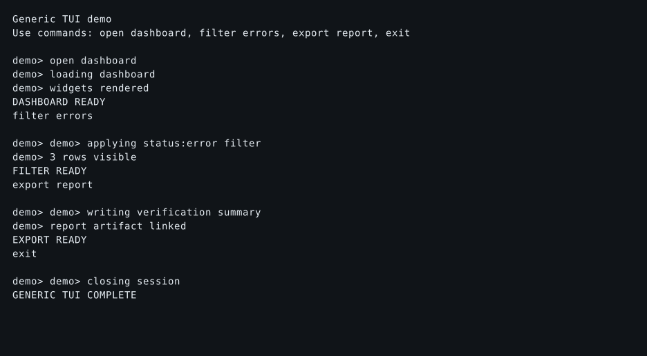

# TermProof

[](https://github.com/md-mt/termproof/actions/workflows/python-ci.yml)
[](https://github.com/md-mt/termproof/actions/workflows/rust-ci.yml)
[](LICENSE)
[](https://pypi.org/project/termproof/)
[](https://crates.io/crates/termproof)
[](https://github.com/md-mt/termproof)


> **Evidence-first verification for terminal and TUI applications.** No more
> "trust me, it works in my terminal." Record the real session, replay it, and
> ship the proof.

TermProof drives your terminal program from a recipe on a real pseudo-terminal,
records what actually happened, asserts against it, and leaves the evidence
behind for a reviewer to inspect. Your reviewers read artifacts instead of
trusting a log line.

**This repository holds one project with two implementations.** They share one
recipe specification, one conformance corpus, one version train and one issue
tracker. The Python implementation is the shipped product and the behavioural
oracle; the Rust implementation is an in-progress port measured against it.

| | [Python](python) | [Rust](rust) |
| --- | --- | --- |
| Status | shipped product, behavioural oracle | in progress, **not at parity** |
| Use it when | you want the full evidence pipeline — screenshots, video, reports, PR comments | you want a single prebuilt CLI binary, a library, or JUnit output |
| Distribution | [`termproof` on PyPI](https://pypi.org/project/termproof/), Homebrew, container, git, source | [`termproof` on crates.io](https://crates.io/crates/termproof), CLI from a git tag |
| Recipes | `*.recipe.json` | JSON **and** YAML |
| Read first | [`python/README.md`](python/README.md) | [`rust/docs/status-and-parity.md`](rust/docs/status-and-parity.md) |

**If you are choosing today, choose Python.** It is the implementation the
project ships, the one the evidence pipeline lives in, and the one the other is
measured against.

## The shortest demonstration

A recipe says: launch this, wait for that, type this, assert what appeared.

```json
{
  "recipe_version": 1,
  "name": "my-tui-main-flow",
  "command": { "argv": ["my-tui"], "pty": true },
  "steps": [
    { "name": "wait for prompt",    "action": "wait_for_text", "text": "my-tui>" },
    { "name": "open dashboard",     "action": "send_line",     "text": "open dashboard" },
    { "name": "wait for dashboard", "action": "wait_for_text", "text": "DASHBOARD READY" }
  ],
  "assertions": [
    { "type": "output_contains", "value": "DASHBOARD READY" }
  ],
  "expect_exit_code": 0
}
```

Run it against the portable example TUI checked into this repository — no
external binary needed:

```bash
git clone https://github.com/md-mt/termproof.git
cd termproof/python
uv run termproof run examples/generic --video
cat .termproof/runs/*/report.md
```

## Demo

The final screenshot from `python/examples/generic`, checked in as evidence:



More checked-in evidence you can read without running anything:

- [`latest-pi-workflows-report.md`](python/examples/artifacts/latest-pi-workflows-report.md)
  — a full report with assertion tables.
- [`generic-tui-workflow/`](python/examples/artifacts/generic-tui-workflow) —
  the cast, the final screenshot, the per-step snapshots and the result JSON
  from one run.

## What a run produces

The Python implementation writes, per run:

| Artifact | What it is |
| --- | --- |
| `session.cast` | the [asciinema v2](https://docs.asciinema.org/manual/asciicast/v2/) recording — the source of truth everything else derives from |
| `final.svg` / `final.txt` | the final screen, in colour and as text |
| `steps/` | a screenshot and a text snapshot per step, plus `steps-manifest.json` |
| `session.mp4` | H.264 video, with `--video` |
| `result.json` | machine-readable verdict and artifact paths |
| `report.md`, `latest-report.md` | the per-run and aggregate review summaries |

Two things worth knowing before you promise them to anyone:

- **The per-step screenshots under `steps/` are monochrome.** They are rendered
  from plain text. `final.svg` and the `attributed_rsvg` video backend render
  from the attributed grid and carry colour; the per-step images do not.
- **Video needs external tools.** `agg` + `ffmpeg` for the default backend, or
  `rsvg-convert` + `ffmpeg` for `attributed_rsvg`. A prebuilt `agg` is bundled
  in the platform wheels.

The Rust implementation writes `result.json`, `report.md`, `raw_output.txt`,
`screen.txt` and `session.cast`, plus `latest-report.md` at the output root. It
accepts `--video`, `--diff`, `--update-baselines` and `--skip-unchanged` and
**warns that it is ignoring them** — the renderers, the tmux backend, the
attributed screen and the uploader exist as tested library APIs with no CLI
caller. [`rust/docs/status-and-parity.md`](rust/docs/status-and-parity.md) is
the full inventory.

## Two implementations, one contract

What makes "two implementations" mean something is that neither is the
definition. The definition is written down, and the agreement between them is
measured rather than asserted.

- **[`spec/`](spec)** — the recipe format, the seven built-in step actions and
  the eight built-in assertions, specified independently of either codebase.
  Open questions are numbered and tracked in the specs themselves.
- **[`conformance/`](conformance)** — a differential harness. A probe drives
  the Python implementation over a checked-in corpus and records what it says;
  a Rust test replays the same corpus and reports how often the two agree. The
  test fails if agreement drops below a recorded floor.

The current measurement, from
[`conformance/README.md`](conformance/README.md):

| Layer | Full agreement (`name`, `passed` and `detail`) | Verdict agreement (`passed`) |
| --- | --- | --- |
| Steps | 82 / 115 | 113 / 115 |
| Assertions | 124 / 147 | 143 / 147 |

Read those as **layer-level measurements, not a product parity figure**. What
they leave out is as important as what they cover: 87 of the 115 step cases run
against a stub session rather than a real terminal, so screen fidelity,
scrollback and escape handling are outside the number entirely; the assertion
corpus feeds fixed strings for `screen`, `raw_output` and `exit_code`, so
nothing upstream of the assertion is measured; and whole-recipe execution is
measured by eleven cases that stop at the verdict.

The corpus is also **not a stable baseline**. The recorded expectations are the
Python implementation's testimony as observed on one machine, and a good number
of the remaining divergences are error strings owned by CPython, libc or
`jsonschema` rather than by TermProof — so the numbers can move without either
implementation changing. Regenerating the expectations turns a failing
comparison into a passing one without changing any behaviour, which is why
`conformance/README.md` says to do it only deliberately.

## Install

### Python

```bash
pip install termproof
# or from Homebrew
brew tap md-mt/termproof https://github.com/md-mt/termproof
brew install termproof
# or unreleased, from GitHub
pip install git+https://github.com/md-mt/termproof.git
# or from source
git clone https://github.com/md-mt/termproof.git && cd termproof/python && uv run termproof --help
```

There is also a container image (`ghcr.io/md-mt/termproof`) and a reusable
GitHub Action ([`python/action.yml`](python/action.yml)).

### Rust

```sh
cargo add termproof                      # the library
```

The `termproof-cli` binary is deliberately not published to crates.io — the
name is a one-way door and the binary is not ready to spend one. It installs
from a release tag, and prebuilt archives for Linux x86-64, macOS x86-64 and
macOS arm64 are attached to each Rust release with a `.sha256` and a provenance
attestation. They are ordinary dynamically-linked builds — `gnu` on Linux, not
`musl` — so they are not static binaries and do not run on a distribution with
an older glibc than the runner's. Releases up to `0.3.3` were cut before the
consolidation and carry unprefixed `v*` tags; from `0.3.4` they are tagged
`rs-v*` in this repository. See
[releases](https://github.com/md-mt/termproof/releases).

There is also a container image, `ghcr.io/md-mt/termproof-rust`, carrying
`rsvg-convert` and `ffmpeg`. It keeps that name because consumers pull it.

**Windows is unverified for both implementations** — no CI job, no binary. A
PTY-heavy project gets no Windows badge until real terminal behaviour passes
there.

## Use it in CI

Copy-paste for GitHub Actions — the same three steps this repository runs:

```yaml
- name: Install agg + ffmpeg
  run: |
    sudo apt-get update && sudo apt-get install -y ffmpeg
    if ! command -v agg >/dev/null 2>&1; then
      cargo install --locked --git https://github.com/asciinema/agg --tag v1.9.0
    fi

- name: Run TermProof
  run: uv run termproof run .termproof/recipes --video --video-fps 60 --out .termproof/ci

- name: Upload TermProof evidence
  uses: actions/upload-artifact@v4
  if: always()
  with:
    name: termproof-ci-evidence
    path: .termproof/ci
    if-no-files-found: ignore
```

This repository also posts a sticky **TermProof CI Report** comment on every
pull request, with the run link, the base-commit report, the head report and
the behavioural delta. See
[`.github/workflows/python-ci.yml`](.github/workflows/python-ci.yml) for the
full implementation, and
[`python/docs/ci/`](python/docs/ci) for GitLab, CircleCI and Docker.

## Why not X?

| Tool | Approach | Where it falls short for TUI evidence |
| --- | --- | --- |
| **Screenshots in docs** | manual capture | stale within one PR; no replay; no assertion |
| **expect / pexpect alone** | scripted PTY driving | no cast, no video, no per-step screenshots, no report |
| **Playwright / Cypress** | browser DOM automation | designed for the web; cannot drive a terminal PTY, ANSI or Ink renderers |
| **VHS (Charm)** | tape files → GIF | great for demos, not for assertions, CI gates or evidence bundles |
| **asciinema alone** | manual `asciinema rec` | no driving, no assertions, no report pipeline |
| **TermProof** | recipe → PTY → cast → screenshots → video → report → artifact | assertions, deterministic runs, PR comments, evidence archives |

If you want demo GIFs, use VHS. If you want verifiable, reviewable, replayable
proof that your TUI behaves, use TermProof.

## What is published

| Distribution | Published today |
| --- | --- |
| `termproof` on PyPI | yes, through 0.3.4 |
| `termproof` crate on crates.io | yes, through 0.3.4 |
| `termproof-cli`, `termproof-plugin-protocol` crates | no — held back with `publish = false` |
| Rust CLI binaries | attached to each Rust release |
| `ghcr.io/md-mt/termproof`, `ghcr.io/md-mt/termproof-rust` | yes |

Both implementations share a version train, so a version number means the same
point in the project's history for both. The artifacts do not: a release is cut
per implementation and tagged `py-v<version>` or `rs-v<version>`.

## Repository layout

| Path | What is in it |
| --- | --- |
| [`python/`](python) | the Python implementation, its docs, examples and the plugin template |
| [`rust/`](rust) | the Rust workspace — `termproof` (the library, and the only crate that publishes), `termproof-cli` (the `termproof` binary), `termproof-plugin-protocol` |
| [`spec/`](spec) | the recipe format and built-in semantics both implementations answer to |
| [`conformance/`](conformance) | the differential harness and its corpus |
| [`.github/`](.github) | workflows for both implementations, issue and PR templates |

Each Rust crate carries its own `README.md` and `LICENSE`, because that copy —
not the workspace root's — is what `cargo package` puts in the published
tarball and what crates.io renders. The Rust workspace documents are
[status and parity](rust/docs/status-and-parity.md),
[architecture](rust/docs/architecture.md),
[conditional recipes](rust/docs/conditional-recipes.md),
[engineering baseline](rust/docs/engineering-baseline.md),
[publishing](rust/docs/publishing.md) and
[governance](rust/docs/governance.md).

## Community

- [`CONTRIBUTING.md`](CONTRIBUTING.md) — the ladder, per-implementation setup,
  and the PR-only process.
- [`SUPPORT.md`](SUPPORT.md) — where each kind of question belongs.
- [`CODE_OF_CONDUCT.md`](CODE_OF_CONDUCT.md) — Contributor Covenant 2.1.
- [`SECURITY.md`](SECURITY.md) — private vulnerability reporting.
- [`CHANGELOG.md`](CHANGELOG.md) — one history for both implementations.
- [`python/docs/plugins.md`](python/docs/plugins.md) — community steps,
  assertions, session backends, reporters and video backends.

**GitHub Pages demo:** once Pages is enabled on this repository
(`ENABLE_PAGES=true`, plus Settings → Pages → Source: GitHub Actions), the
rendered site will be at https://md-mt.github.io/termproof/. Until then,
preview locally with `python3 -m http.server 8000 --directory python/site`.

## Verified by TermProof

If you verify your TUI with TermProof, add the badge:

[](https://github.com/md-mt/termproof)

```md
[](https://github.com/md-mt/termproof)
```

See [`python/docs/verified-badge.md`](python/docs/verified-badge.md) for
variants and usage guidelines.

## Licence

MIT — see [LICENSE](LICENSE). `python/LICENSE` and each crate's `LICENSE` are
the same text, kept where the packaging expects to find them.
