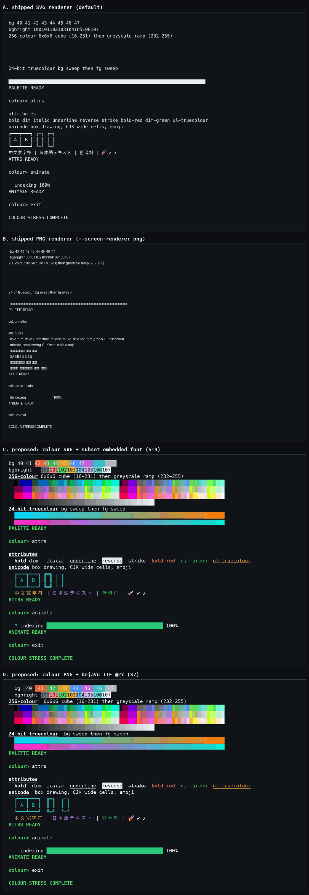
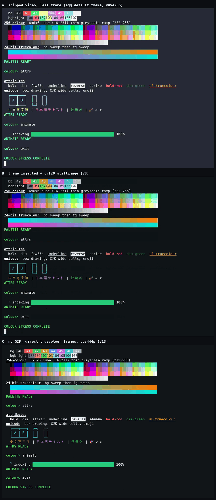

# Evidence quality: what the research found

**Last updated:** 2026-08-18

> **Status, 0.3.0.** This page is the record of what the research measured, and
> it is kept in the tense it was written in. Four of the things it describes as
> defects or as deferred have since been done, and the sections below have not
> been rewritten around them:
>
> - **The attributed-grid path is implemented** (`termproof/attributed.py`). The
>   `svg` renderer draws colour and text attributes, and `render_attributed` is
>   the optional renderer method the research proposed. "The defect" below
>   describes what `screen_text` still does — it is still the source of
>   `final.txt` and of the text handed to assertions — but it is no longer the
>   only path a renderer sees.
> - **The GIF-free direct-frame video backend exists** as the opt-in
>   `attributed_rsvg` backend, and remains opt-in for the reason given below.
> - **Step-screenshot dedup exists**, opt-in via `evidence.dedup_step_screenshots`,
>   and fingerprints the attributed grid rather than the screen text. Until
>   step grids existed that fingerprint could only ever see the text; it can
>   now see colour.
> - **Per-step screenshots now render from a grid too**, when the session that
>   produced the step reported one. `StepResult` carries an optional
>   `screen_attributed`; every built-in session backend fills it. The last
>   section has what is still true of the ones that do not.
>
> Still open: no font ships with TermProof, the browser half of SVG font
> embedding is still unverified, and **dim still does not survive the
> cast-replay path** — the finding below about SGR 2 is unchanged, and it is now
> pinned by `test_dim_does_not_survive_the_cast_replay_path`.

TermProof's whole value proposition is that the artifact it produces is a
faithful record of what happened in the terminal. Two independent research
tracks measured how faithful it actually is. This page is the durable summary,
written for a contributor who was not part of that work: what is wrong, what was
measured, what configuration is recommended, and what is deliberately not fixed
yet.

Nothing on this page is enabled by default. Every rendering parameter it
recommends is expressible in `.termproof/config.yaml`, and every default still
reproduces the previous hardcoded behaviour byte for byte.

---

## The defect

`termproof/screen.py` reads only the flat character grid out of the terminal
emulator's buffer:

```python
def screen_text(screen: pyte.Screen) -> str:
    lines = [line.rstrip() for line in screen.display]
    while lines and not lines[-1]:
        lines.pop()
    return "\n".join(lines)
```

`screen.display` is already the flattened character grid: every colour and every
text attribute is discarded *before* any renderer is called. No renderer can
draw what it was never given — not the built-in SVG or PNG renderers, not
xterm.js, not a browser. Both research tracks independently identified this
flattening as the blocking issue, and both proposed the same shape of fix: an additive, optional attributed-grid path that leaves the
existing `ScreenRenderer` protocol untouched.

This has been invisible because **the example corpus was 100% monochrome** —
zero coloured cells across roughly 13,500. On the recipes the project ships, the
SVG output looks fine. That is why `examples/colorstress/` now exists: it is the
only recipe in the corpus that can tell a renderer that reproduces colour from
one that throws it away. Without it, the defect is not detectable by any test.

Two further findings, both cheap to act on:

- **Exactly 50% of consecutive step screenshots are byte-identical**, on every
  multi-step recipe. Detecting this is a hash comparison.
- **`agg` (v1.9.0) cannot emit anything but GIF.** Removing the GIF round-trip
  means replacing the tool, not reconfiguring it. agg also silently drops
  strikethrough.

---

## What was measured

| | shipped | best measured | change |
|---|---|---|---|
| Screenshot foreground fidelity (colour-heavy) | 41.9% (SVG) / 37.2% (PNG) | 84.9% | +43 pts |
| Screenshot grid alignment | 51.7% (PNG) | 100% | +48 pts |
| Video foreground fidelity, last frame | 66.9% | 95.9% | +29 pts |
| Video size | 791 KB | 552 KB | −30% |
| Screenshot bytes, whole corpus | 977 KB (PNG) | 971 KB | −6 KB |

The recommended screenshot configuration is strictly better than the shipped PNG
renderer on every metric *and* slightly smaller. The shipped video configuration
is not on the efficient frontier at all.

### The video finding nobody predicted

The GIF intermediate was the prime suspect. It is real, but it is the smaller of
two causes. Isolating them on last-frame foreground accuracy:

| | `yuv420p` | `yuv444p` |
|---|---|---|
| **via GIF** | 64.5% | 76.9% |
| **direct frames, no GIF** | 73.6% | **95.9%** |

The 256-colour GIF palette costs about 9 points. **4:2:0 chroma subsampling
costs about 22.** Subsampling averages colour over 2×2 pixel blocks, which is
close to a worst case for one-pixel-wide coloured text. So most of the video win
is available from encoder flags alone — no new dependency, no new rendering
path.

### Contact sheets

Both sheets were produced from `examples/colorstress` and carry the whole
argument. Panel A in each is what TermProof ships today.

**Screenshots** — A: shipped SVG. B: shipped PNG. C and D: the proposed colour
paths. A and B are the defect: flat monochrome, and the PNG's proportional
bitmap font drifts off the character grid and drops non-ASCII glyphs entirely.



**Video, last frame** — A: shipped (agg default theme, `yuv420p`). B: theme
injected plus still-image encoder flags. C: GIF-free direct frames at `yuv444p`.
Video keeps colour because agg re-renders the cast itself rather than going
through `screen_text`; what it loses is fidelity, to the palette and to chroma
subsampling.



---

## Recommended configuration

Drop this into `.termproof/config.yaml`. Every key is real and parses today;
the annotations say which ones actually change the artifact today.

```yaml
evidence:
  # --- Effective today ------------------------------------------------------
  video:
    # yuv444p is the single largest video win: 4:2:0 chroma subsampling costs
    # ~22 points of foreground fidelity on coloured text.
    pix_fmt: yuv444p
    crf: 20
    preset: slow
    tune: stillimage
    # 60 fps asks for frames that centisecond-quantised cast data cannot
    # supply; the surplus is duplicate frames.
    fps: 24
    fps_cap: 24
    # Passed straight through to agg. A theme must carry a full 16-colour
    # palette: an attempt that supplied only (bg, fg) rendered at 14.2%
    # background accuracy, which is unreadable. Treat that as the acceptance
    # test if you set this.
    # theme: "101418,e6edf3,<16 palette colours>"

  # Skips writing a second image when a step's screen is unchanged, and records
  # every step in steps-manifest.json so nothing is lost. ~32% of screenshot
  # bytes on the shipped corpus.
  dedup_step_screenshots: true

  png:
    # A real monospace face fixes grid alignment (51.7% -> 100%) and the missing
    # non-ASCII glyphs. No font ships with TermProof: point this at one you have,
    # or leave it unset to keep PIL's bundled proportional bitmap face.
    font_path: /usr/share/fonts/truetype/dejavu/DejaVuSansMono.ttf
    font_size: 14
    scale: 2

  # --- Effective, with the attributed-grid path in place --------------------
  # These are the *defaults* a cell falls back to, not a global override: a cell
  # that names no colour of its own is drawn in them. They were inert when every
  # renderer received flat text; now that final.svg and the per-step images
  # render from a grid, they set the theme around the colour the grid carries.
  svg:
    fg: "#e6edf3"
    bg: "#101418"
    font_size: 14
```

> **`yuv444p` compatibility caveat, not fully discharged.** H.264 `yuv444p`
> requires the High 4:4:4 profile. Modern browsers and players handle it; some
> hardware decoders do not. If the audience is unknown, `yuv420p` at `crf: 18`
> is the safe pick and still beats the current default.

`fps` is also reachable per-run as `termproof run --video-fps N`, which is the
last step of the same cascade (builtin → user → project → `--config` → flag).

Unknown keys under `evidence` are rejected rather than ignored: a misspelled
rendering knob that silently does nothing is indistinguishable from one that had
no effect.

---

## What is deferred, and why

**Per-step screenshots render from a grid when the session supplies one — and
three things about that are still open.** `StepResult` now carries an optional
`screen_attributed`, filled by `screen.capture_screen`, which reads the grid
first and derives the step's text from it so the `.txt` and the `.svg` beside it
cannot describe different instants. All four built-in session backends supply a
grid (pty via pyte, pty+asciinema and Docker through the same session class, and
tmux through `capture-pane -e`), as does the agent-driven mode from its cast
replay. Measured over the 13 example recipes, step screenshots carrying
attributed rendering went from 0/76 to 11/76 — 9 in colour and 11 with text
attributes — with the other 65 byte-identical, because the recipes behind them
drive genuinely monochrome TUIs. What remains:

- **A session backend that reports no grid still renders from plain text.**
  That is the designed fallback, not a defect, but it means "step screenshots
  are in colour" is not a claim the code supports in general.
- **The `png` renderer implements only the text-only protocol**, so PNG step
  screenshots are monochrome regardless. That is the same licence-blocked
  per-cell PNG work described below.
- **The corpus cannot pin a colour step image.** `CorpusByteIdentityTest`
  re-renders each step entry from its recorded `.txt`, which is correct for the
  entries checked in — they predate the grid — but nothing on disk carries a
  step's grid, so a regenerated corpus would produce images the gate cannot
  reproduce. Recording the grid beside the text (an SGR-encoded `.ans`
  alongside each `.txt`, say) is the follow-up.

**A step image and a video frame of the same moment are not the same bytes.**
`final.svg` and the `attributed_rsvg` video both come from replaying the cast,
which is why the final screenshot and its frame match exactly. A step grid is
read from the live session at the moment of the step, which is the only place
that moment exists. The correspondence claim belongs to the final screenshot
only.

**No font ships with TermProof.** `evidence.png.font_path` loads a TrueType face
when you give it one, but bundling a default requires a licence decision (DejaVu
Sans Mono, permissive, ~700 KB in the wheel, is what was tested). That decision
belongs to the change that makes it the default.

**A GIF-free direct-frame video backend** measured best by a wide margin, but it
is a genuinely new rendering path with its own cell metrics and is ~3× slower to
produce. It belongs as an opt-in backend, not a default.

### Two things neither track could verify

**The browser half of SVG font embedding is untested.** One track ranked an
SVG renderer with an embedded WOFF2 font as its most deterministic option — "the
font travels inside the artifact". The other tested that claim and found it
false for non-browser consumers: **resvg ignores `@font-face` entirely**, proven
with a discriminator rather than an inference (an SVG embedding Helvetica under
the family name `tpface` renders byte-identically, sha256 `01c739f2…`, to the
same SVG asking for plain `monospace`). Since `agg --renderer resvg` uses resvg
too, the embedded font is simply not being used. What remains unmeasured is
whether an embedded font works when the SVG is viewed **in a browser or a PR
diff**. No browser would launch in the research environment: Chromium, Firefox
and WebKit all failed identically at the same Mach-port rendezvous, so it was
the sandbox, not the browser. Settling this needs an environment where a browser
will actually launch.

**Dim text cannot currently be fixed.** The terminal emulator library in use
does not model SGR 2, so dim renders at full intensity in every approach tested.
Only a browser-hosted emulator would change that.

What *was* measured about the browser route: xterm.js running headless under
Node with no browser (`svg-term-cli`) **lost to the current baseline** on colour
accuracy (0.262 vs 0.361), drifted 26 cells off the grid, embedded no font, and
took 7.7 s per recipe against 0.02–0.7 s for the direct rasterisers. The thing a
browser would add is font handling and text shaping, not a better terminal
model — and the direct rasterisers already reach 100% colour accuracy and
0.42-cell drift, which a browser can match but not beat.

---

## Suggested change sequence

Small, independently reviewable, each one useful alone.

1. **Colour-stress fixture and the config surface.** Done — this page, plus
   `examples/colorstress/` and the `evidence:` config block.
2. **Attributed grid path** — the additive interface change. Done, in two
   parts: the renderer's optional `render_attributed`, then
   `StepResult.screen_attributed` carrying the grid as far as the per-step
   screenshots.
3. **PNG renderer: bundled scalable font, drawn per cell.** Needs the licence
   decision.
4. **Deduplicate identical consecutive step screens via a manifest** — the
   mechanism exists behind `dedup_step_screenshots`; turning it on by default is
   a separate call.
5. **Video encoder flags plus theme** — all reachable from config today;
   choosing new defaults is a separate call.
6. **Optional: GIF-free direct-frame video backend**, opt-in, not the default.
